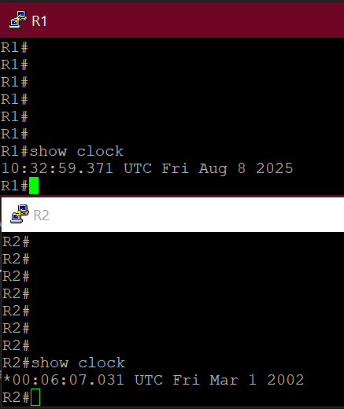
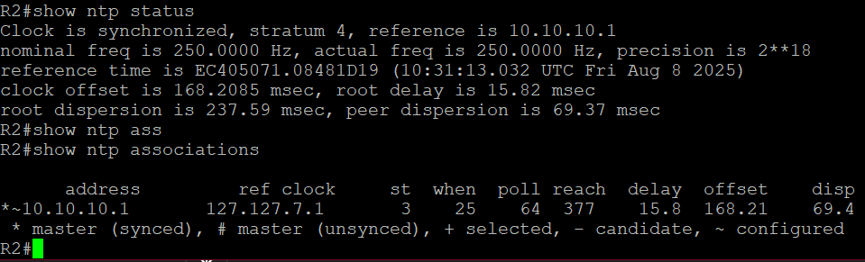
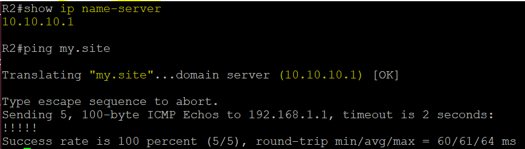
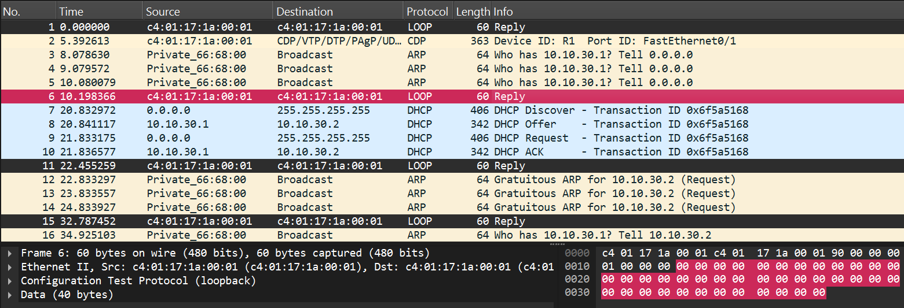
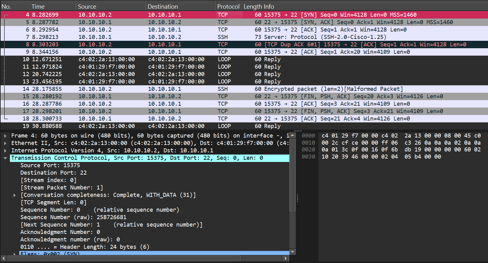
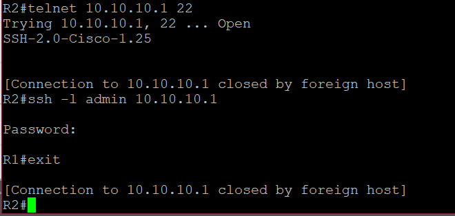

# 📡 Отчёт по проекту CbS2\_Networking\_basics\_Part\_2

---

## 🛠 Задание 1. Статическая маршрутизация

**🎯 Цель:** Освоить принципы работы статической маршрутизации.

**📋 Шаги выполнения:**

1. Создал новый проект в **GNS3**.
2. Добавил три устройства Cisco 3745 и назвал их **R1**, **R2** и **R3**.
3. Соединил их в топологию "цепочка" (R1 ↔ R2 ↔ R3).
4. Назначил IP-адреса:

   * **R1 ↔ R2**: `10.10.10.0/24`
   * **R2 ↔ R3**: `10.10.20.0/24`
5. Настроил статические маршруты:

   * На **R1** — маршрут к сети между R2 и R3 через интерфейс R2.
   * На **R3** — маршрут к сети между R1 и R2 через интерфейс R2.
6. Проверил связность с помощью `ping` (от R1 к R3 и обратно).
7. Запустил **Wireshark**, захватил ICMP-трафик и сохранил его как `static.pcap`.

---

## ⏱ Задание 2. NTP

**🎯 Цель:** Настроить синхронизацию времени через NTP.

**📋 Шаги выполнения:**

1. На **R1** настроил NTP-сервер (`ntp master`).
2. На **R2** вручную выставил неверное время.
3. Настроил на R2 синхронизацию с R1 (`ntp server 10.10.10.1`).
4. Запустил Wireshark для захвата NTP-пакетов.
5. После синхронизации проверил корректность времени.
6. В дампе нашёл первый NTP-пакет и записал:

   * Протокол 4-го уровня
   * Source/Destination порты
   * Значение **Transmit timestamp**
7. Сохранил дамп как `ntp.pcap` и ответы в `ntp.txt`.

📸 **Скриншоты:**  
  

💡 **Примечание:** NTP позволяет синхронизировать время даже без доступа к интернету, используя один из маршрутизаторов как эталон.

---

## 🌐 Задание 3. DNS

**🎯 Цель:** Настроить разрешение имён через DNS.

**📋 Шаги выполнения:**

1. Создал **loopback**-интерфейс на R1 для устойчивости работы DNS.
2. Настроил DNS-сервер на R1, добавил запись для `my.site` (с IP loopback).
3. На R2 указал R1 как DNS-сервер.
4. Запустил Wireshark и начал захват.
5. Выполнил `ping my.site` на R2, убедился в успешном разрешении имени.
6. Записал тип и класс DNS-запроса в `dns.txt`.
7. Сохранил дамп как `dns.pcap`.

📸 **Скриншот:**  
  

💡 Примечание: Добавление loopback-интерфейса позволяет сохранить доступность сервиса при перезапуске физических интерфейсов.

---

## 📦 Задание 4. DHCP

🎯 Цель: Настроить автоматическую выдачу IP-адресов по DHCP.

📋 Шаги выполнения:

1. Добавил в проект виртуальный ПК (vPC).
2. Подключил его к R1.
3. Настроил интерфейс на R1 в сети `10.10.30.0/24`.
4. Настроил DHCP-сервер на R1 (пул на 50 адресов).
5. Запустил Wireshark.
6. На vPC включил автоматическое получение IP.
7. Выполнил `ping` с vPC до R1.
8. В Wireshark проанализировал процесс DORA (Discover, Offer, Request, Acknowledge), ответы записал в `dhcp.txt`.
9. Сохранил дамп как `dhcp.pcap`.

📸 Скриншоты:  
  
  

💡 Примечание: DHCP автоматизирует конфигурирование IP-адресов, что снижает вероятность ошибок ручной настройки.

---

## 🔒 Задание 5. SSH

🎯 Цель: Настроить защищённое удалённое подключение.

📋 Шаги выполнения:

1. На R1 настроил SSH:

   * Создал пользователя `admin` с паролем.
   * Настроил VTY-линии для SSH.
   * Сгенерировал RSA-ключи.
2. На R2 проверил доступность порта 22 (`telnet`).
3. Подключился с R2 к R1 по SSH, ввёл пароль, затем вышел.
4. В Wireshark проанализировал TCP handshake и трафик SSH.
5. Сохранил дамп как `ssh.pcap`.

📸 Скриншоты:  
  
  

💡 Примечание: SSH обеспечивает безопасную аутентификацию и шифрование, в отличие от Telnet.

---

## 📚 Дополнительно изучено

* Принципы работы ICMP, ARP, DNS, DHCP и NTP
* Конфликты IP-адресов и их устранение
* Различия между TCP и UDP при передаче данных
* Основы защиты сетей от атак на уровне L2 и L3

> Все `.pcap`, `.txt` и изображения находятся в репозитории.
