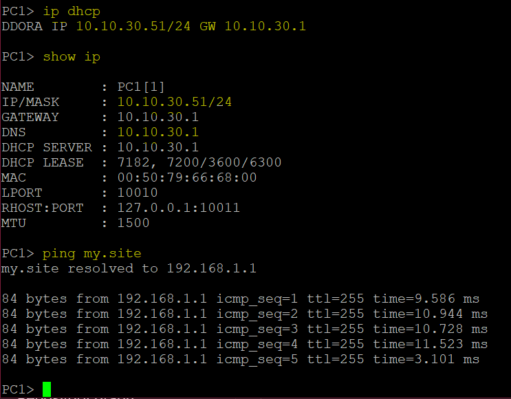

# Отчет по проекту CbS2_Networking_basics_Part_2
---

## Задание 1. Статическая маршрутизация

**Цель:** Освоить принципы работы статической маршрутизации.

**Шаги выполнения:**

1. Создал новый проект в GNS3.
2. Добавил три устройства Cisco 3745 и назвал их **R1**, **R2** и **R3**.
3. Соединил их в топологию "цепочка" (R1-R2-R3).
4. Назначил IP-адреса:

   * R1 ↔ R2: сеть `10.10.10.0/24`
   * R2 ↔ R3: сеть `10.10.20.0/24`
5. Настроил статические маршруты:

   * На R1 — маршрут к сети между R2 и R3 через интерфейс R2.
   * На R3 — маршрут к сети между R1 и R2 через интерфейс R2.
6. Проверил связь с помощью `ping` (от R1 к R3 и обратно).
7. Запустил Wireshark, захватил трафик ICMP и сохранил его в файл **static.pcap**.

---

## Задание 2. NTP

**Цель:** Настроить синхронизацию времени через NTP.

**Шаги выполнения:**

1. На R1 настроил NTP-сервер (`ntp master`).
2. На R2 задал неправильное время вручную.
3. Настроил на R2 синхронизацию с R1 (`ntp server 10.10.10.1`).
4. Запустил Wireshark и начал захват пакетов.
5. После синхронизации проверил корректность времени.
6. Изучил в Wireshark первый NTP-пакет и записал:

   * Протокол 4-го уровня.
   * Source/Destination порты.
   * Значение **Transmit timestamp**.
7. Сохранил pcap как **ntp.pcap**.
8. Ответы занес в файл **ntp.txt**.

**Скриншоты:**

---

## Задание 3. DNS

**Цель:** Настроить разрешение имен через DNS.

**Шаги выполнения:**

1. Создал loopback-интерфейс для устойчивости DNS.
2. На R1 настроил DNS-сервер и добавил запись для `my.site` (с IP loopback-интерфейса).
3. На R2 указал R1 как DNS-сервер.
4. Запустил Wireshark и начал захват.
5. Выполнил `ping my.site` на R2 — проверил успешное разрешение имени.
6. Записал в **dns.txt** тип и класс DNS-запроса.
7. Сохранил дамп как **dns.pcap**.

**Скриншот:**

---

## Задание 4. DHCP

**Цель:** Настроить автоматическую выдачу IP-адресов по DHCP.

**Шаги выполнения:**

1. В проект добавил виртуальный ПК (**vPC**).
2. Подключил его к R1.
3. Настроил интерфейс на R1 в сети `10.10.30.0/24`.
4. Настроил DHCP-сервер на R1 с пулом на 50 адресов.
5. Запустил Wireshark.
6. Настроил на vPC автоматическое получение IP (DHCP).
7. Выполнил `ping` с vPC до R1.
8. Изучил в Wireshark процесс DORA, записал ответы в **dhcp.txt**.
9. Сохранил дамп как **dhcp.pcap**.

**Скриншоты:**

---

## Задание 5. SSH

**Цель:** Настроить защищенное удаленное подключение.

**Шаги выполнения:**

1. На R1 настроил SSH:

   * Создал пользователя **admin** с паролем.
   * Настроил VTY-линии для SSH.
   * Сгенерировал RSA-ключи.
2. На R2 проверил доступность 22 порта с помощью `telnet`.
3. Подключился с R2 к R1 по SSH, ввел пароль, затем выполнил `exit`.
4. Изучил в Wireshark TCP handshake и трафик Telnet.
5. Сохранил дамп как **ssh.pcap**.

**Скриншоты:**

